# My works

## Metaverse

🌍 [**Live Demo**](https://millisabel.github.io/Metaverse/)

📂 [**GitHub Repository**](https://github.com/millisabel/Metaverse)

Modern landing page for the metaverse with interactive elements and animations.

- Responsive design for all devices
- Smooth animations with AOS & Three.js
- Performance optimization (lazy loading, minification)

📅 **Duration:**  April - June, 2025

🛠️ **Technologies:** 

HTML5 | SCSS | JavaScript (ES6+) | Webpack 5 | Bootstrap 5 | AOS | Three.js | GitHub Actions

👀 **Preview**

  
  
  
  

## Shelter

🌍 [**Live Demo**](https://rolling-scopes-school.github.io/millisabel-JSFE2023Q1/shelter/)

🎯 Educational project completed as part of the course [RS School](https://rs.school/).

- Responsive design for all devices
- infinite carousel slider
- pagination, popup, burger menu

🛠️ **Technologies:**  HTML | SCSS | JS

📅 **Duration:** April, 2023

👀 **Preview**

  
  
  
  

## Momentum

🌍 [**Live Demo**](https://rolling-scopes-school.github.io/millisabel-JSFEPRESCHOOL2022Q4/momentum/)

🎯 Educational project completed as part of the course [RS School](https://rs.school/).

The application has a clock, image slider, weather widgets, audio player, quote of the day block, settings. Local storage - local storage - is used to store user name and locality.
- working with date and time;
- Custom audio player;
- saving data to local storage;
- using recursive setTimeout;
- dividing js-code into modules;
- working with asynchronous requests.

🛠️ **Technologies:**  HTML | SCSS | JS

📅 **Duration:** February, 2023

👀 **Preview**

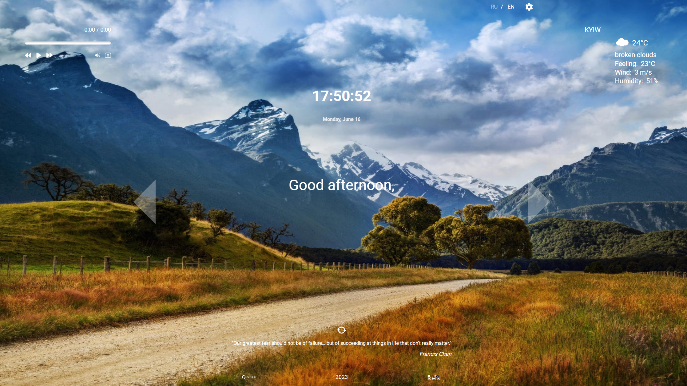

## Plants

🌍 [**Live Demo**](https://rolling-scopes-school.github.io/millisabel-JSFEPRESCHOOL2022Q4/plants/)

🎯 Educational project completed as part of the course [RS School](https://rs.school/).

landing page of the site, which offers its services in growing plants in the garden and care of them.

🛠️ **Technologies:**  HTML | SCSS | JS

📅 **Duration:** February, 2023

👀 **Preview**

  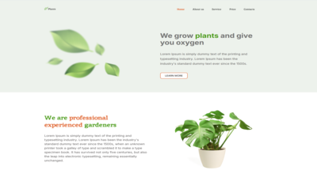
  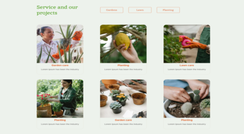
  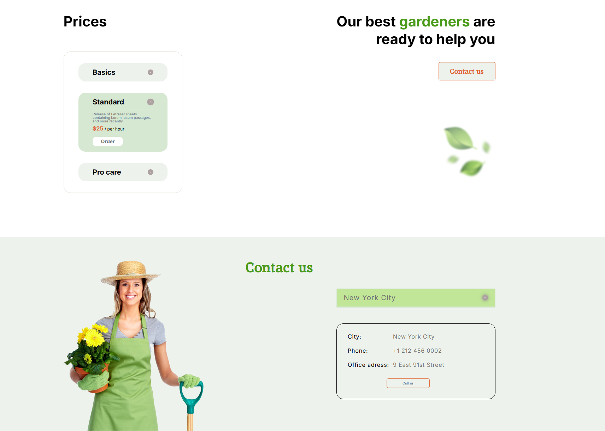

## Filmoscope

🌍 [**Live Demo**](https://millisabel.github.io/Learning-Projects/movie-app/)

📂 [**GitHub Repository**](https://github.com/millisabel/Learning-Projects/tree/master/movie-app)

🎯 Educational project completed as part of the course [RS School](https://rs.school/).

Implementation of an application that displays information about movies upon user request.

- Work with the The Movie Database (TMDB)
- Adaptive design
- [TMDB API](https://www.themoviedb.org/documentation/api)

🛠️ **Technologies:**  HTML | SCSS | JS

📅 **Duration:** January, 2022

👀 **Preview**

  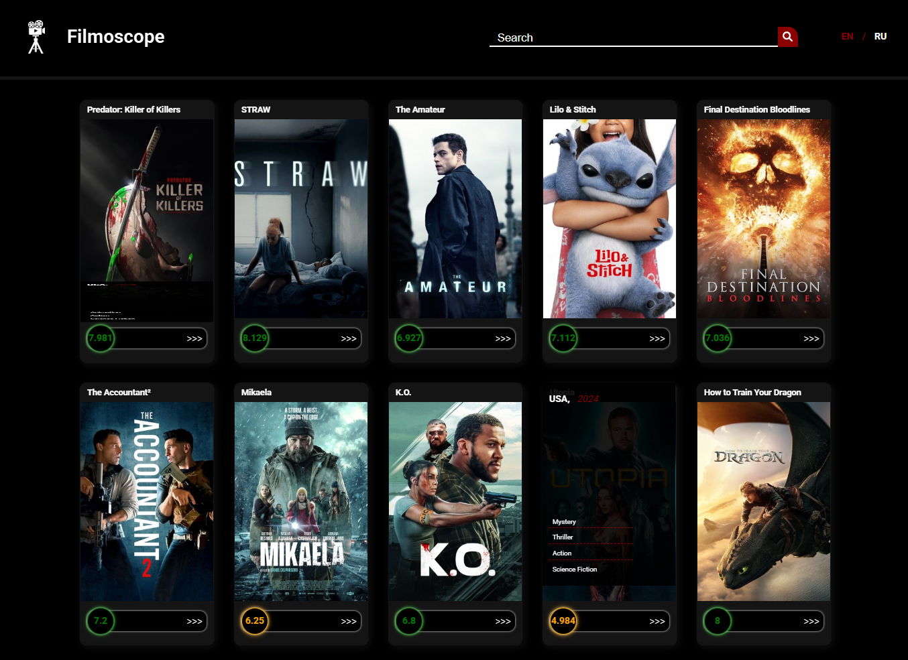
  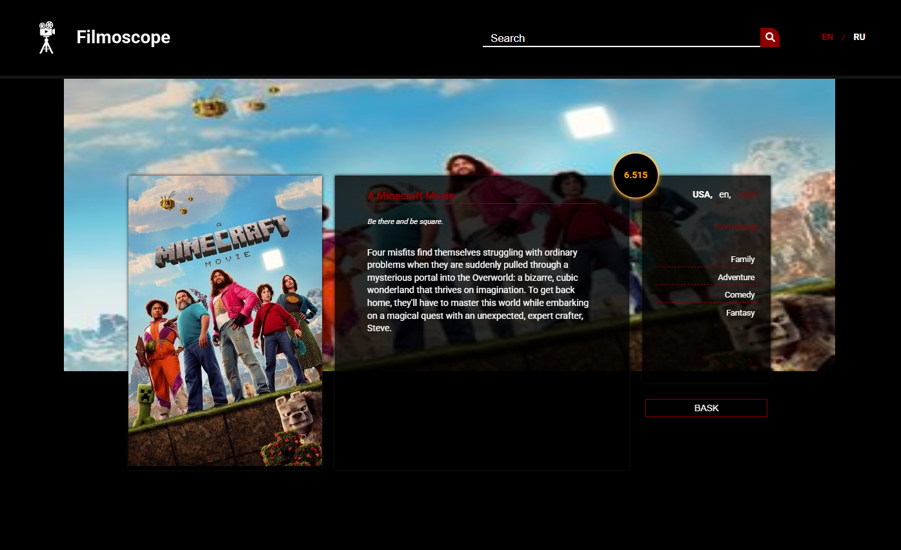

## Portfolio for a photographer

🌍 [**Live Demo**](https://millisabel.github.io/Learning-Projects/portfolio/)

📂 [**GitHub Repository**](https://github.com/millisabel/Learning-Projects/tree/master/portfolio)

🎯 Implementation of an application that displays information about movies upon user request.

Web site for photographer.

- Light/Dark theme
- Adaptive design
- Pixel Perfect
- Custom video player
- Text translation

🛠️ **Technologies:**  HTML | CSS | JS

📅 **Duration:**      January, 2022

👀 **Preview**

  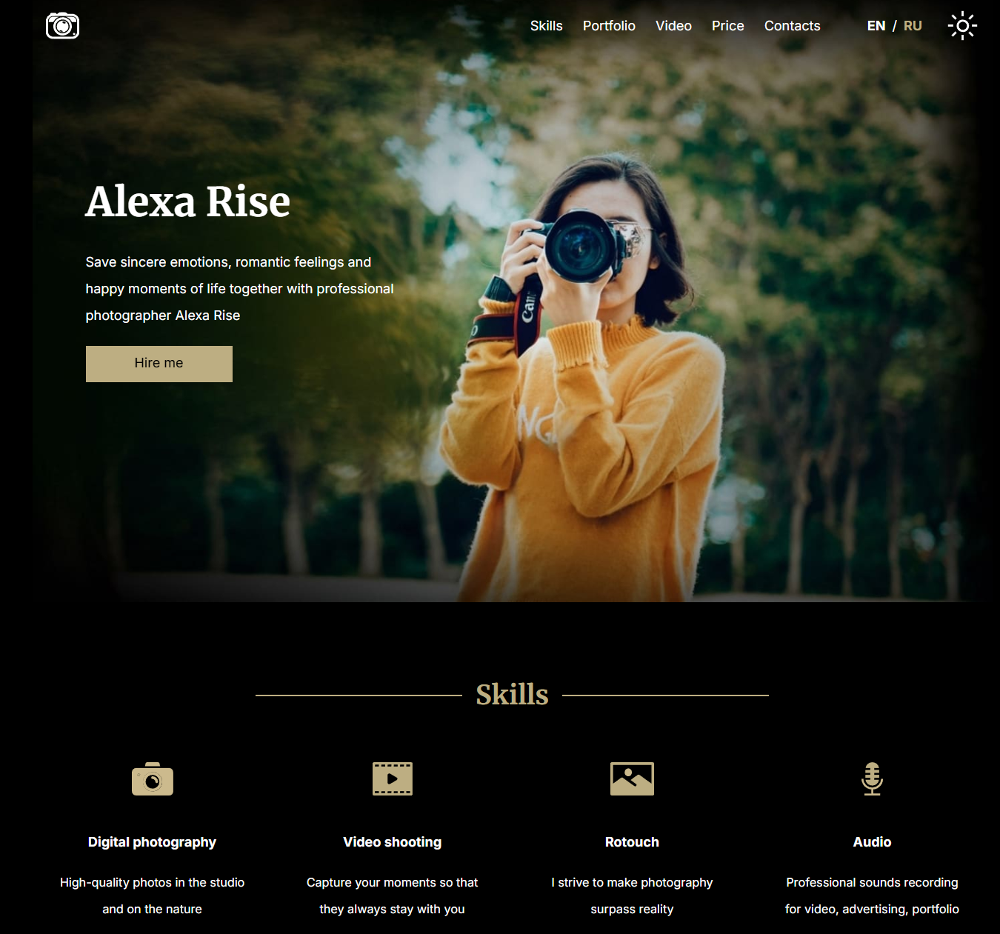
  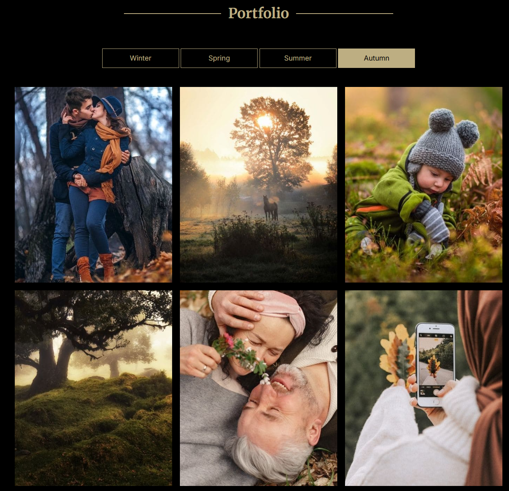
  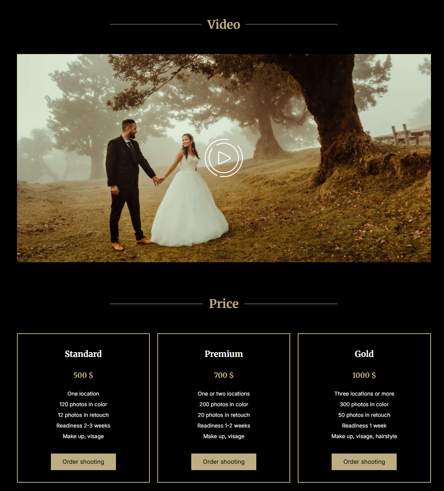

## Botanika

🌍 [**Live Demo**](https://millisabel.github.io/zaverstai-2/)

📂 [**GitHub Repository**](https://github.com/millisabel/zaverstai-2)

🎯 Educational project as part of the marathon «Заверстаю» from [HTML Academy](https://htmlacademy.ru/).

Landing page for a flower delivery company

🛠️ **Technologies:**  HTML | CSS | JS

📅 **Duration:**      August, 2022

👀 **Preview**

  
  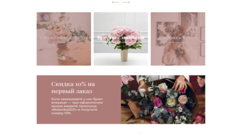
  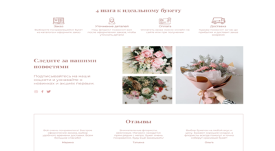

## DEVChallenge

🌍 [**Live Demo**](https://millisabel.github.io/DEVChallenge/)

📂 [**GitHub Repository**](https://github.com/millisabel/DEVChallenge)

Website for the company in the crypto industry (We took 3rd place in the Frontend Layout nomination in DEV Challenge XVII)

- Light/Dark theme
- Adaptive design
- Pixel Perfect
- work with API YouTube
I use:
- Glide JS
- Animate.css
- YouTube API

🛠️ **Technologies:**  HTML | CSS | JS

📅 **Duration:**      November 2020

👀 **Preview**

  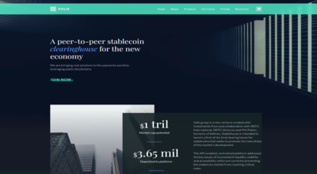
  
  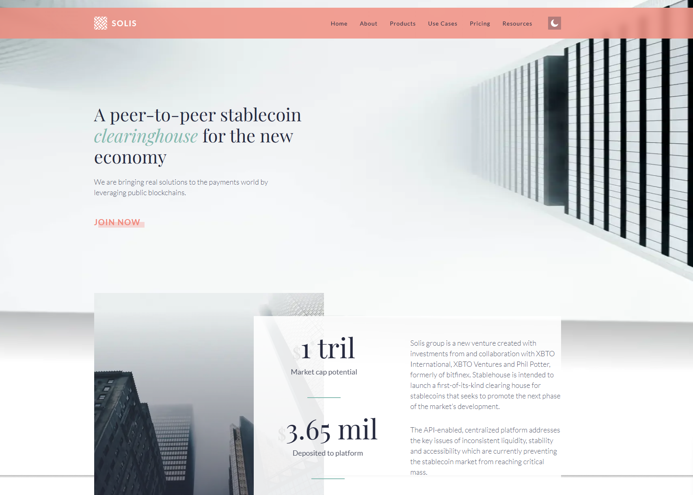
  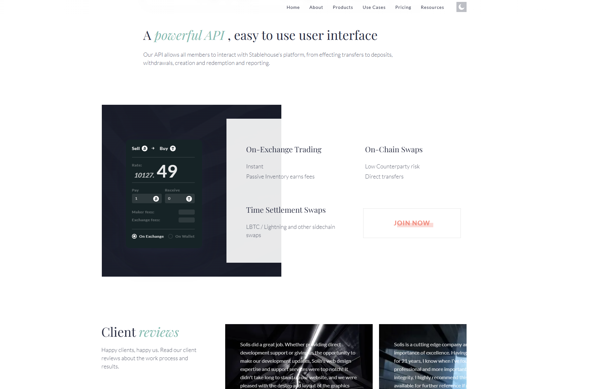

## 🧩 Other Projects

- [**Cozy hotel for cats**](https://millisabel.github.io/Learning-Projects/hotelcats/) — Landing page for a pet hotel: room catalog, filtering, booking, testimonials, responsive design.
- [**Saper (game)**](https://millisabel.github.io/Learning-Projects/saper/) — Classic Minesweeper game in JavaScript with timer and mine counter.
- [**CSS Bayan**](https://millisabel.github.io/cssBayan/cssBayan/index.html)— Accordion (bayan) built with pure CSS: expandable sections without JavaScript.
- [**Virtual-Keyboard**](https://millisabel.github.io/RSS-Virtual-Keyboard/src/index.html)— Virtual keyboard in JavaScript: supports mouse and keyboard input, language switching.
- [**Air-pollution**](https://millisabel.github.io/air-pollution/) — Interactive dashboard visualizing air pollution data by city and pollutant.

