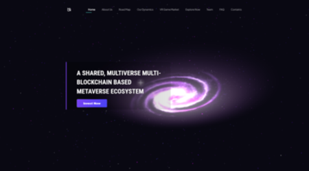
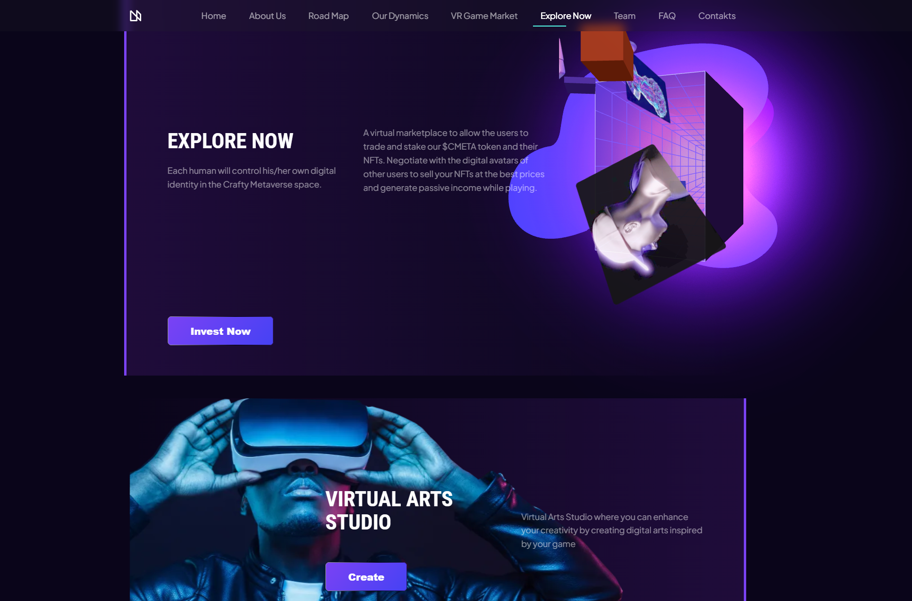
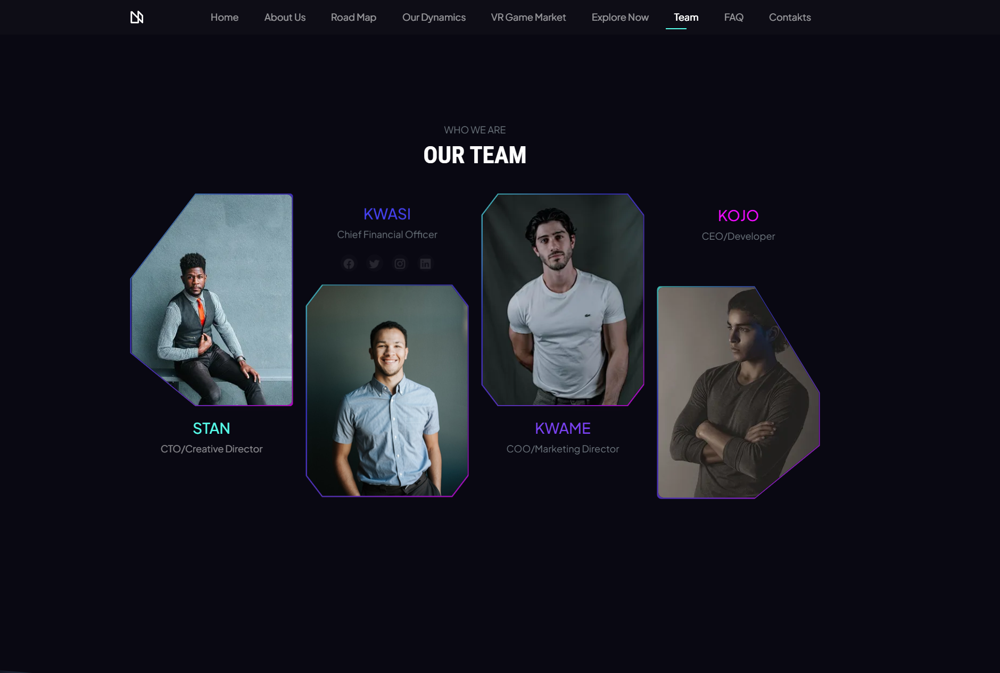
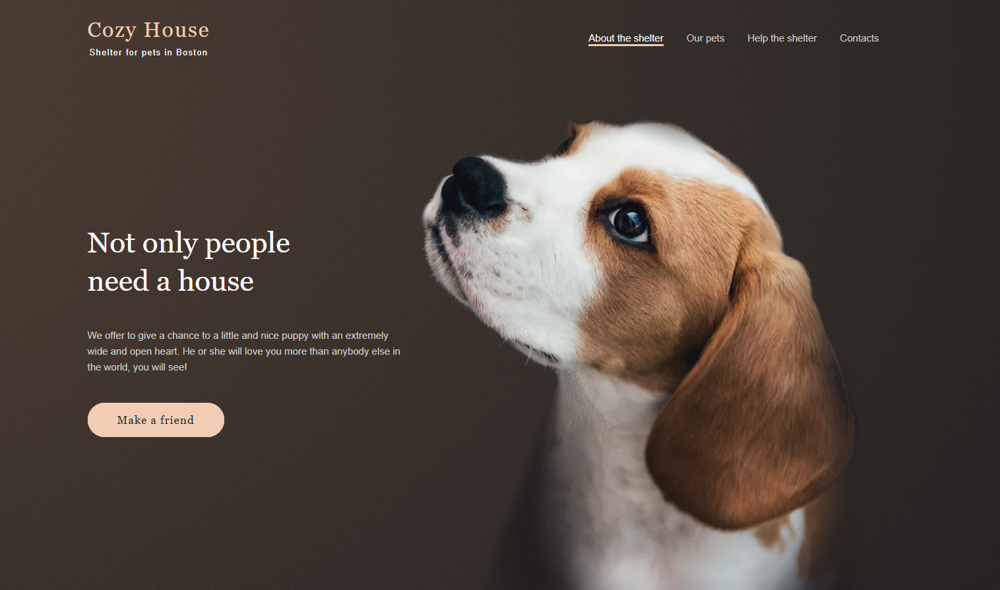
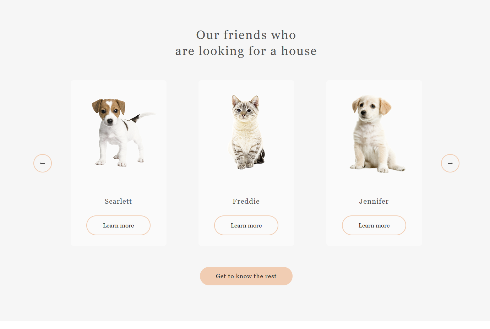
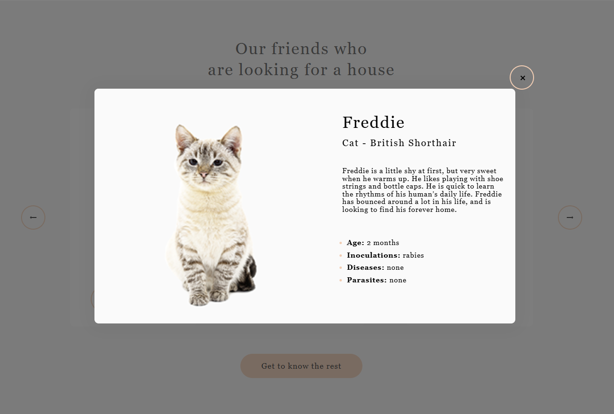

# My works

## Metaverse

🌍 [**Live Demo**](https://millisabel.github.io/Metaverse/)

📂 [**GitHub Repository**](https://github.com/millisabel/Metaverse)

Modern landing page for the metaverse with interactive elements and animations.

- Responsive design for all devices
- Smooth animations with AOS & Three.js
- Performance optimization (lazy loading, minification)

📅 **Duration:**  April - June, 2025

🛠️ **Technologies:** 

HTML5 | SCSS | JavaScript (ES6+) | Webpack 5 | Bootstrap 5 | AOS | Three.js | GitHub Actions

**👀 Preview**

  
  
  
  

## Shelter

🌍 [**Live Demo**](https://rolling-scopes-school.github.io/millisabel-JSFE2023Q1/shelter/)

🎓 Educational project completed as part of the course [RS School](https://rs.school/).

- Responsive design for all devices
- infinite carousel slider
- pagination, popup, burger menu

🛠️ **Technologies:**  HTML | SCSS | JS

📅 **Duration:** April, 2023

**👀 Preview**

  
  
  
  

