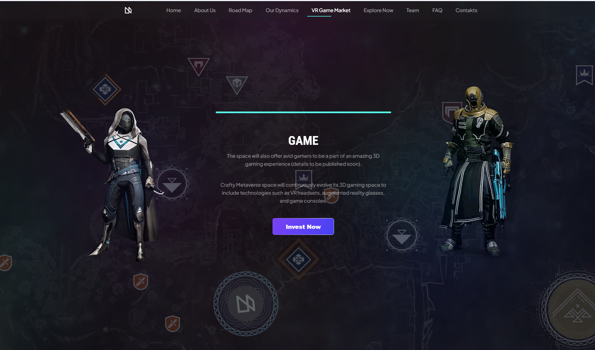
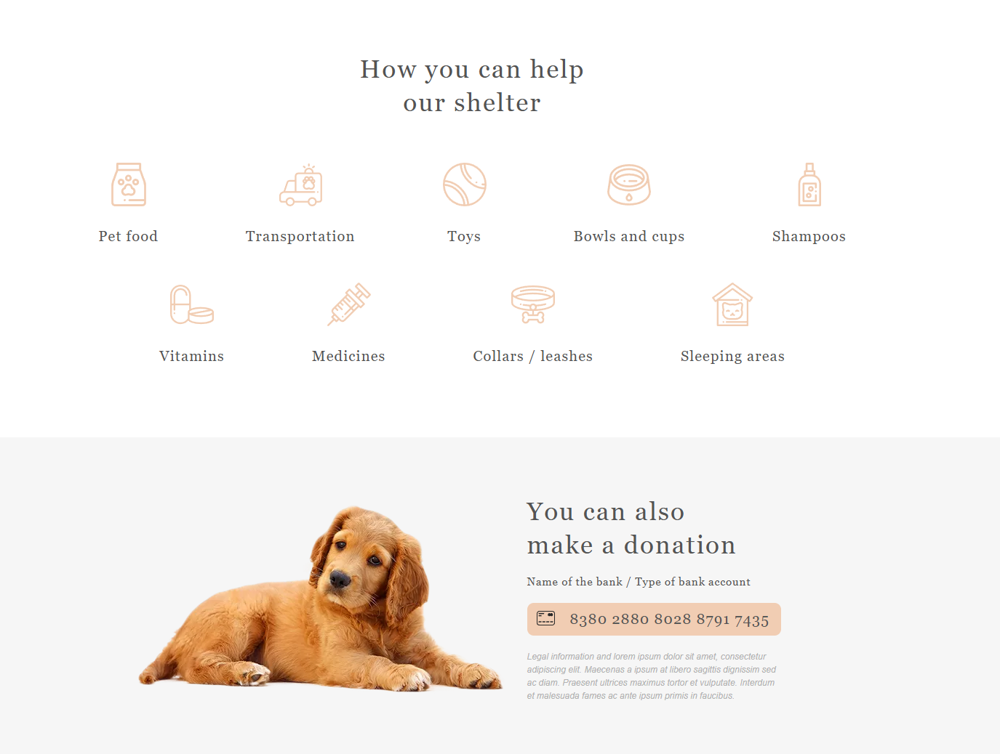

# My works

## Metaverse

🌍 [**Live Demo**](https://millisabel.github.io/Metaverse/)

📂 [**GitHub Repository**](https://github.com/millisabel/Metaverse)

Modern landing page for the metaverse with interactive elements and animations.

- Responsive design for all devices
- Smooth animations with AOS & Three.js
- Performance optimization (lazy loading, minification)

📅 **Duration:**  April - June, 2025

🛠️ **Technologies:** 

HTML5 | SCSS | JavaScript (ES6+) | Webpack 5 | Bootstrap 5 | AOS | Three.js | GitHub Actions

👀 **Preview**

  
  
  
  

## Shelter

🌍 [**Live Demo**](https://rolling-scopes-school.github.io/millisabel-JSFE2023Q1/shelter/)

🎓 Educational project completed as part of the course [RS School](https://rs.school/).

- Responsive design for all devices
- infinite carousel slider
- pagination, popup, burger menu

🛠️ **Technologies:**  HTML | SCSS | JS

📅 **Duration:** April, 2023

👀 **Preview**

  
  
  
  

## Momentum

🌍 [**Live Demo**](https://rolling-scopes-school.github.io/millisabel-JSFEPRESCHOOL2022Q4/momentum/)

🎓 Educational project completed as part of the course [RS School](https://rs.school/).

The application has a clock, image slider, weather widgets, audio player, quote of the day block, settings. Local storage - local storage - is used to store user name and locality.
- working with date and time;
- Custom audio player;
- saving data to local storage;
- using recursive setTimeout;
- dividing js-code into modules;
- working with asynchronous requests.

🛠️ **Technologies:**  HTML | SCSS | JS

📅 **Duration:** February, 2023

👀 **Preview**

## Plants

🌍 [**Live Demo**](https://rolling-scopes-school.github.io/millisabel-JSFEPRESCHOOL2022Q4/plants/)

landing page of the site, which offers its services in growing plants in the garden and care of them.

🎓 Educational project completed as part of the course [RS School](https://rs.school/).

🛠️ **Technologies:**  HTML | SCSS | JS

📅 **Duration:** February, 2023

👀 **Preview**

  
  
  

## Filmoscope

🌍 [**Live Demo**](https://millisabel.github.io/Learning-Projects/movie-app/)

🎓 Implementation of an application that displays information about movies upon user request.

 Educational project completed as part of the course [RS School](https://rs.school/).

- Work with the The Movie Database (TMDB)
- Adaptive design
- [TMDB API](https://www.themoviedb.org/documentation/api)

🛠️ **Technologies:**  HTML | SCSS | JS

📅 **Duration:** January, 2022

👀 **Preview**

  
  

